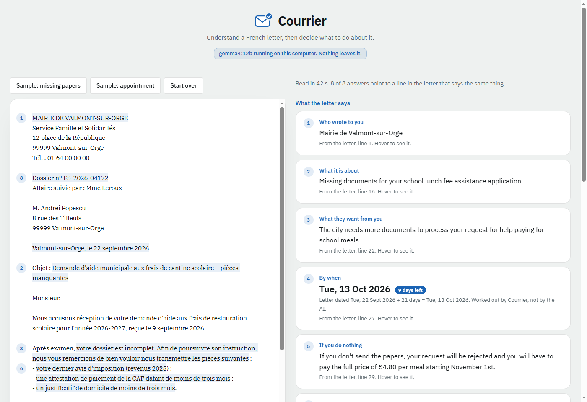

# Courrier

Courrier helps someone who lives in France, and does not read French well, understand an administrative letter and act on it.

It reads the letter and says in plain English who wrote, what they want, by when, what happens if you do nothing, which documents to send and how to reach them. Every answer is pinned to the line of the letter it came from, so you can check it. Then it suggests a reminder, a checklist and a reply draft, and you approve, edit or skip each one. Courrier never sends anything.

October 2026. Designed and built by [Alex Oprea](https://opreadoru.com). Free and open source under the MIT licence.

See it live: [courrier-six.vercel.app](https://courrier-six.vercel.app). The version in this repo runs entirely on your own computer.



## Why not just ask a chatbot

You can paste a letter into a chatbot and get a good summary. But the person who most needs that summary is the one who cannot check it against the French. Courrier changes three things.

- **You can check every answer.** Each one points to its line in the letter. An answer whose line cannot be found says so.
- **You do not need to know what to ask.** The questions that matter for an administrative letter are asked for you, every time.
- **The reading becomes actions you control.** The reminder, the checklist and the reply are proposals. Nothing happens until you approve, and you can undo each step.

The rule behind it is simple. The model finds, the code checks and the person decides.

## How it works

- **The model reads.** gemma4:12b runs on your computer through [Ollama](https://ollama.com). It returns each answer together with the exact quote it is based on, in a fixed JSON format.
- **The code checks.** Courrier finds each quote in the letter and pins it with a number. Numbers in an answer must appear in the letter. A second model pass compares each answer with its quote, and anything that does not match is flagged.
- **Dates are worked out in code.** A date counts as a deadline only if the words around it present it as one, so the letter's own date and a signature date are never taken as deadlines. A delay such as "21 jours" is counted from the letter's date, and the weekday written in the letter is checked against the calendar.
- **Letters in any form.** Paste the text, or drop a PDF, a photo or a .txt file. A PDF with text shows the real page with the highlights drawn on its words. A scan or a photo is transcribed by the model and labelled as transcribed by AI.
- **Nothing leaves your computer.** The page talks to Ollama on your own machine through a small Node server. There is no account, no cloud service and no tracking.

## Run it on your computer

You need:

- [Ollama](https://ollama.com) 0.30.5 or later
- [Node.js](https://nodejs.org) 18 or later
- About 8 GB of disk space for the model. A graphics card with 12 GB of memory makes it quick, and on an RTX 4070 a reading takes 15 to 45 seconds. Without one, Ollama uses the processor, which works but is much slower.

```
ollama pull gemma4:12b
git clone https://github.com/opreadoru/courrier.git
cd courrier
node server.mjs
```

Then open http://localhost:5179 and start with one of the two sample letters. There is nothing to install with npm, because the server uses only Node's built-in modules, and pdf.js and the fonts are in `vendor/`.

### Let an AI assistant set it up

If you use Claude Code, Cursor or another coding assistant, open this folder and ask it to follow [SETUP-WITH-AI.md](SETUP-WITH-AI.md). It checks your machine, asks before installing anything, downloads the model and starts Courrier.

### Other models

Add `?model=` to the address to try another Ollama model, for example `http://localhost:5179/?model=qwen3:14b`. Only gemma4:12b was tested properly. ministral-3:8b was compared and did worse (see below).

## What testing showed

- **The two sample letters:** 8 of 8 answers pinned to the right line on both.
- **Six real documents** (a quote, a fee notice, a contributions summary, a software guide and two scanned forms). Before the date rules, both models tested invented deadlines from the letter's own date or a signature date, and both failed on long scans. After the fixes there were no failures and no invented deadlines, and the results were the same across three runs. The second check flagged three answers. Two were fair flags, and the third was a correct answer pinned to the wrong line.
- **ministral-3:8b against gemma4:12b:** Ministral gave vaguer answers, took a wrong deadline from "48 heures à l'avance", changed its answers between runs, answered partly in French, and invented one answer ("send it by registered post") that it pinned to an unrelated line. That last case shows what a pin can and cannot do. It proves the quote exists in the letter, and it says nothing about whether the quote supports the answer. The second check exists for that reason.

## Known limits

- A transcription error passes every check, because the answer and its pin share the misread text. In testing, a reference number came out as 6104776 instead of 6104716.
- Suggested actions can be out of date. It once offered a cancellation reply for a contract from 2022.
- Phone photos of creased letters are untested.
- It reads French letters and answers in English. Reply drafts are in French, with an English version next to them.
- Use it to understand a letter, and check anything that matters with whoever sent it.

## Files

```
index.html         the whole app: interface, model calls, quote pinning, date maths, PDF view, actions
server.mjs         serves the page and forwards /api/* to Ollama on localhost:11434
letter1.txt        sample letter: missing papers, a deadline counted in days
letter2.txt        sample letter: an appointment, with a deliberately wrong weekday
letter1.pdf        letter1 as a PDF with text, to test uploads
letter1-scan.pdf   letter1 as an image only, to test transcription
vendor/            pdf.js 3.11.174 and the IBM Plex fonts, so it works offline
```

## Credits

[pdf.js](https://mozilla.github.io/pdf.js/) by Mozilla, Apache 2.0 licence. IBM Plex Sans and IBM Plex Serif, SIL Open Font License (`vendor/fonts/OFL.txt`). The sample letters, places, people and addresses are invented.

## Licence

MIT. See `LICENSE`.
